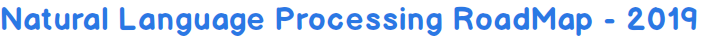
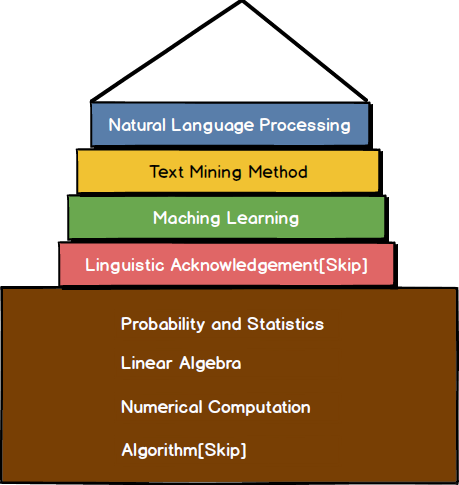
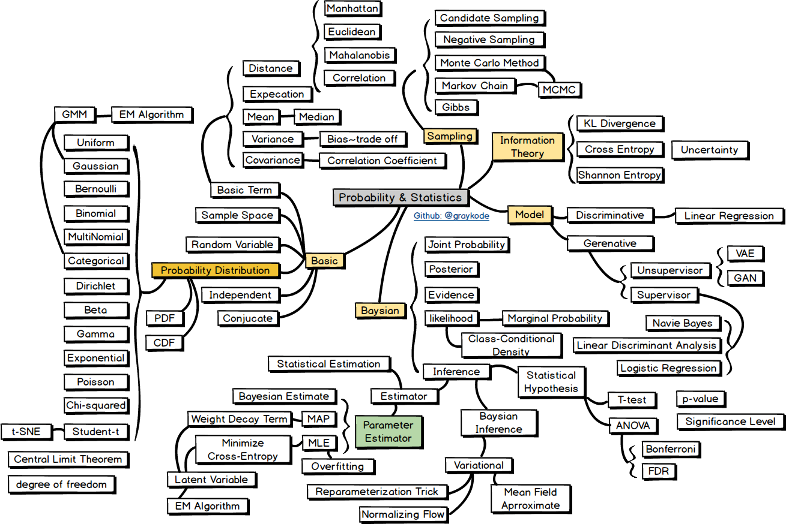
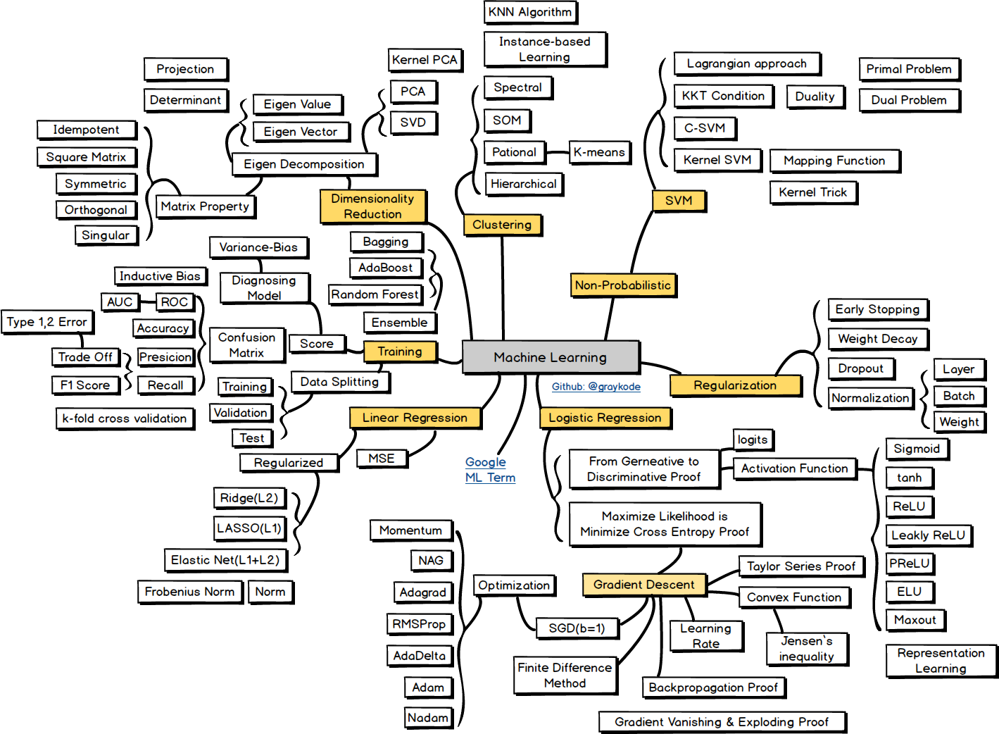
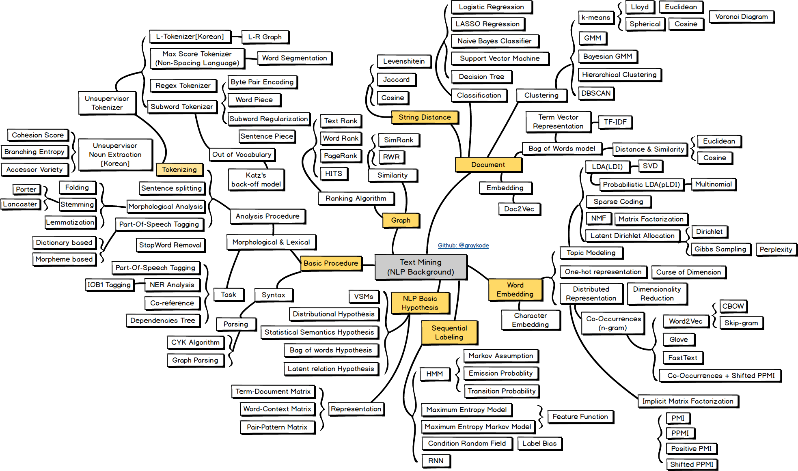
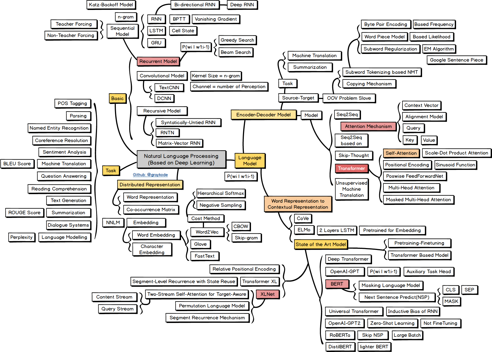

## nlp-roadmap

`nlp-roadmap` is `Natural Language Processing` **ROADMAP(Mind Map)** and **KEYWORD** for students those who have interest in learning Natural Language Processing. The roadmap covers the materials from basic probability/statistics to SOTA NLP models.

#### Caution!

- The relationship among keywords could be interpreted in ambiguous ways since they are represented in the format of a semantic mind-map. Please just focus on **KEYWORD in square box**, and deem them as the essential parts to learn.
- The work of containing a plethora of keywords and knowledge within just an image has been challenging. Thus, please note that this roadmap is one of the suggestions or ideas.
- You are eligible for using the material of your own free will including commercial purpose but **highly expected to leave a reference.**

#### Curriculum

1. [Probability and Statistics](https://github.com/graykode/nlp-roadmap#probability--statistics)

2. [Machine Learning](https://github.com/graykode/nlp-roadmap#machine-learning)

3. [Text Mining](https://github.com/graykode/nlp-roadmap#text-mining)

4. [Natural Language Processing](https://github.com/graykode/nlp-roadmap#natural-language-processing)

    

## Probability & Statistics

## Machine Learning

## Text Mining

## Natural Language Processing

## Contribution
Everyone can contribute to the repository. Contributions can range fixing typos to giving different perspectives on the materials. I welcome your contribution under the identical contribution guide of [kamranahmedse/developer-roadmap](https://github.com/kamranahmedse/developer-roadmap/blob/master/contributing.md).

## Reference

[1] [ratsgo's blog for textmining](https://ratsgo.github.io/), [ratsgo](https://github.com/ratsgo)/[ratsgo.github.io](https://github.com/ratsgo/ratsgo.github.io)

[2] (한국어) 텍스트 마이닝을 위한 공부거리들, [lovit](https://github.com/lovit)/[textmining-tutorial](https://github.com/lovit/textmining-tutorial)

[3] *Christopher Bishop(2006). Pattern Recognition and Machine Learning*

[4] *Young, T., Hazarika, D., Poria, S., & Cambria, E. (2017). Recent Trends in Deep Learning Based Natural Language Processing. arXiv preprint arXiv:1708.02709.*

[5] curated collection of papers for the nlp practitioner, [mihail911](https://github.com/mihail911)/[nlp-library](https://github.com/mihail911/nlp-library)

**Acknowledgement** to [ratsgo](https://github.com/ratsgo), [lovit](https://github.com/lovit) for creating great posts and lectures.

## LICENSE

The class is licensed under the [MIT License](http://opensource.org/licenses/MIT):

Copyright &copy; 2019 [Tae-Hwan Jung](http://www.github.com/graykode).

## Author

- Tae Hwan Jung [@graykode](https://github.com/graykode), Kyung Hee Univ CE(Undergraduate).
- Author Email : [nlkey2022@gmail.com](mailto:nlkey2022@gmail.com)
